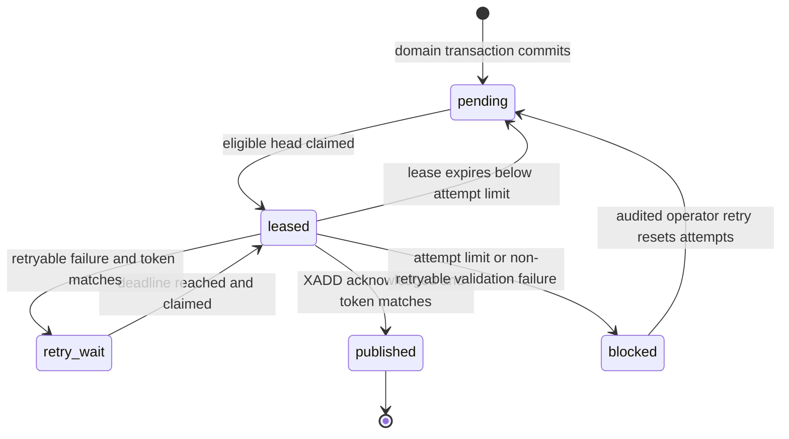
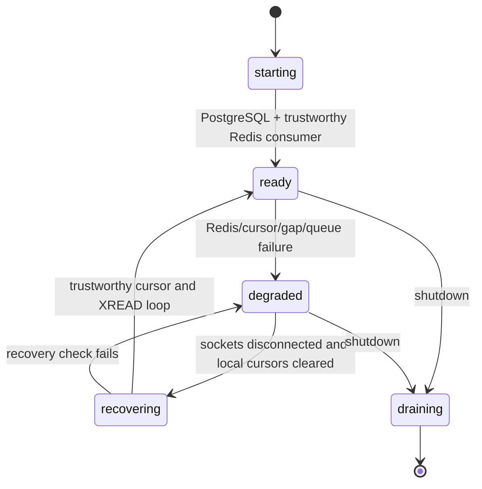
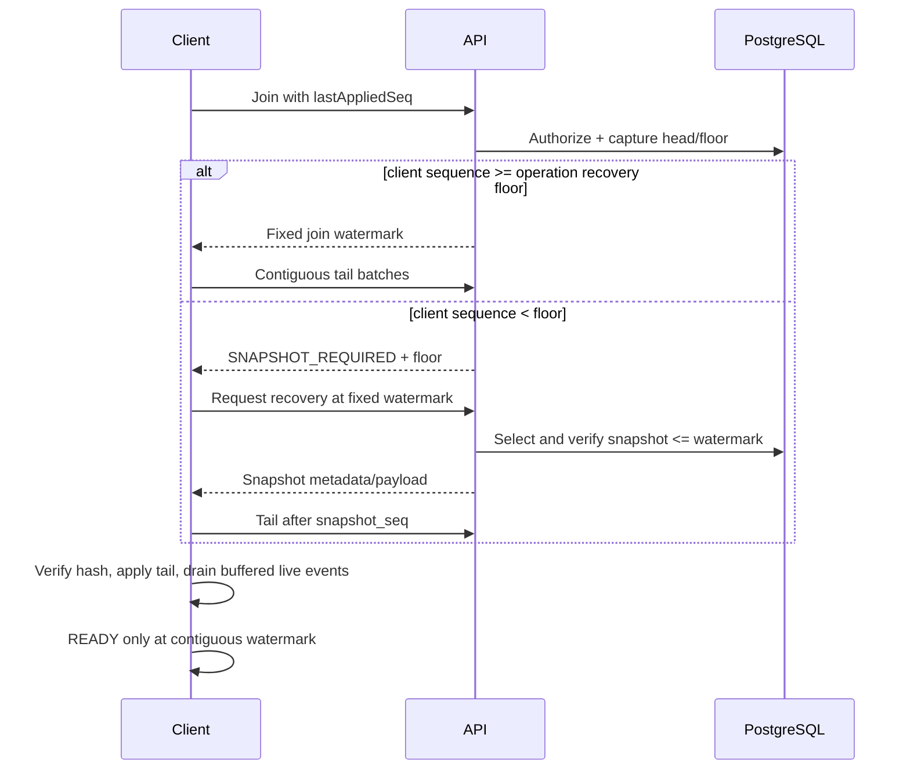

# Milestone 2: Distributed durable delivery

Status: accepted implementation-ready high-level design; M2.1 has not started

## Purpose

Milestone 2 adds durable multi-instance delivery, transactional-outbox recovery,
snapshot-plus-log-tail synchronization, and safe operation-log compaction. PostgreSQL remains the
authoritative durable source of truth. Redis is bounded delivery infrastructure and may be rebuilt
without redefining board state.

This design provides at-least-once publication and consumption. It does not claim exactly-once
network delivery, instantaneous delivery, zero downtime, Redis durability equivalent to PostgreSQL,
or a tested production capacity.

## Scope

- A board-level delivery sequence that orders canvas and access-control events.
- A leased PostgreSQL outbox with crash recovery and per-board head-of-line ordering.
- One worker process type that publishes validated envelopes to a custom Redis Stream.
- Independent consumption by every API replica and local Socket.IO fan-out.
- Cross-instance membership revocation with fail-closed cursor and Redis failure handling.
- Versioned canonical snapshots, snapshot-plus-tail recovery, compact receipts, and explicit floors.
- Bounded concurrency, batches, memory, retry, lease, retention, and diagnostic data.
- Deterministic failure, multi-instance, and convergence acceptance tests.
- Local Docker Compose compatibility and a later Railway/Vercel deployment boundary.

## Non-goals

- Exactly-once delivery or distributed transactions spanning PostgreSQL and Redis.
- Making Redis an authoritative board store.
- Kafka, Kubernetes, per-board processes, or a general event-platform abstraction.
- Premium canvas tools, presence/previews, production OAuth, invitations, or share links.
- Implementing user-visible version history; M2 only preserves a compatible restore model.
- Performance, resume, or Railway capacity claims before committed k6 evidence exists.
- Deployment changes in this design gate.

## Repository baseline verified at the gate

The gate inspected code and tests at `8841f31` on `feat/m02-distributed-delivery`. The annotated
`v0.1.0-m1` tag dereferences to that commit, as do local `main` and `origin/main` in the inspected
checkout. The working tree was initially clean.

Implemented behavior, rather than only `docs/STATUS.md`, establishes this baseline:

- `apps/api` is one Fastify/Socket.IO process. It has `/health` but no readiness endpoint.
- `packages/database` allocates canvas `last_seq + 1` under a transaction-scoped advisory lock,
  reauthorizes under that lock, and atomically writes the operation, projection, board head, and one
  outbox row.
- Exact operation replay compares PostgreSQL JSONB and actor identity, returns the stored operation,
  and does not create another projection or outbox row.
- Membership removal uses the same advisory-lock family, deletes membership, and writes a typed
  outbox row in one transaction. Its current `board_seq` is `NULL`.
- `BoardDeliveryCoordinator` serializes mutation through local room publication/eviction only inside
  one API process. Unrelated boards run concurrently and inactive queue keys are removed.
- `io.to(...).emit(...)` is called after commit and before acknowledgement, but its return is not a
  durable publication acknowledgement. Publication failure is logged and the successful database
  acknowledgement is still attempted.
- Join is room-first, then captures a canvas watermark. HTTP range catch-up is strictly contiguous
  and server-bounded to 100 operations. The web client fences attempts/sessions, deduplicates live and
  catch-up operations, and bounds live buffering to 1,000 operations or 2 MiB.
- The current projection preserves authoritative stack order. Current HTTP snapshots include only
  visible canvas values and `lastSeq`; they are not durable historical recovery snapshots.
- `outbox_events` has only attempts and publication time; no worker, lease, retry schedule, terminal
  state, snapshot, or compaction implementation exists. Failure tests are placeholders.
- Compose already declares PostgreSQL 17.6 and Redis 8.2 with AOF. The API package has no Redis
  dependency and `apps/worker` does not yet exist. CI supplies PostgreSQL only.
- Workspaces already include `apps/*`, `packages/*`, and `tests/*`; the intended worker and existing
  test boundaries fit without introducing another repository.

All accepted M1 authorization, command validation, idempotency, projection, sequence, pending-command,
session-fencing, and convergence guarantees remain prerequisites and must not regress.

## Architecture decisions

The detailed decisions are recorded in:

- [ADR 004: Board delivery sequence](../adr/004-board-delivery-sequence.md)
- [ADR 005: Redis delivery topology](../adr/005-redis-delivery-topology.md)
- [ADR 006: Snapshot and compaction](../adr/006-snapshot-and-compaction.md)

In summary, M2 chooses a custom Redis Stream published by `apps/worker` and independently consumed by
every active API through plain `XREAD` and a process-memory cursor. This exposes a supported positive
Redis acknowledgement (`XADD` returning an entry ID), retains events temporarily, avoids unsupported
`redis-emitter`/Streams-adapter assumptions, and broadcasts without Redis group/PEL lifecycle state.

| Alternative                                          | Reason rejected for M2                                                                                                             |
| ---------------------------------------------------- | ---------------------------------------------------------------------------------------------------------------------------------- |
| Socket.IO Redis Streams adapter with in-API dispatch | `io.emit` does not expose the adapter's durable stream acknowledgement, and writing its private wire format is unsupported.        |
| Classic Redis adapter plus `redis-emitter`           | This supported pair uses non-retained Pub/Sub; `redis-emitter` compatibility with the Streams adapter is not assumed.              |
| One custom-stream consumer group shared by APIs      | Redis would distribute each entry to one replica instead of broadcasting it to all replicas.                                       |
| One custom-stream group per API boot                 | It broadcasts technically but creates stale groups, PEL/XACK recovery, heartbeat, and cleanup state that dead sockets do not need. |
| PostgreSQL polling or `LISTEN`/`NOTIFY` only         | Notification alone is lossy; durable per-instance polling multiplies authority-database pressure and recreates a broker there.     |

## Component responsibilities

| Component                | State and responsibilities                                                                                                                                                                                                                                                            |
| ------------------------ | ------------------------------------------------------------------------------------------------------------------------------------------------------------------------------------------------------------------------------------------------------------------------------------- |
| `apps/web`               | Stateful per browser session. Strictly validate operations, retain pending commands in IndexedDB, deduplicate by canvas sequence/operation ID, perform snapshot-plus-tail catch-up, and never equate a connected socket with `READY`.                                                 |
| `apps/api`               | Horizontally replicated connection edge. Authenticate/authorize reads and commands, commit through database repositories, consume every durable Redis event, sequence it through a board-local coordinator, fan out only to local rooms, and fail closed when delivery trust is lost. |
| `apps/worker`            | Horizontally replicated bounded background process. Claim outbox heads, publish to Redis, transition leases, schedule snapshots/compaction, and perform no Socket.IO client handling.                                                                                                 |
| `packages/protocol`      | Strict versioned command, internal delivery-envelope, snapshot/recovery, readiness, and structured-error schemas.                                                                                                                                                                     |
| `packages/database`      | PostgreSQL schema/migrations and transactional repositories for ordering, outbox leases, recovery reads, receipts, snapshots, and compaction. It owns all durable invariants.                                                                                                         |
| `packages/observability` | Structured logger/tracer/metric interfaces and bounded label definitions shared by API and worker.                                                                                                                                                                                    |
| `packages/testkit`       | Deterministic clocks, barriers, Redis/PostgreSQL fixtures, process controls, multi-instance clients, and convergence helpers.                                                                                                                                                         |
| PostgreSQL               | Authoritative board membership, projection, operations/tail, idempotency receipts, delivery order, outbox state, snapshots, and recovery floors.                                                                                                                                      |
| Redis                    | Non-authoritative bounded stream; no API consumer-group or pending-entry state.                                                                                                                                                                                                       |

## Data model

The names below are normative for implementation; a migration may phase nullability while
backfilling.

### Boards and operations

Add to `boards`:

| Column                            | Constraint and purpose                                                      |
| --------------------------------- | --------------------------------------------------------------------------- |
| `last_delivery_seq bigint`        | `NOT NULL DEFAULT 0 CHECK >= 0`; next durable delivery order.               |
| `operation_recovery_floor bigint` | `NOT NULL DEFAULT 0`; clients below it require a snapshot.                  |
| `delivery_recovery_floor bigint`  | `NOT NULL DEFAULT 0`; API cursors below it cannot replay individual events. |

Add to `board_operations`:

| Column                | Constraint and purpose                           |
| --------------------- | ------------------------------------------------ |
| `event_id uuid`       | `NOT NULL UNIQUE`; stable outbox/event identity. |
| `delivery_seq bigint` | `NOT NULL`; unique with `board_id`.              |

Retain `(board_id, seq)` and `(board_id, op_id)` uniqueness. Add
`UNIQUE (board_id, delivery_seq)` and validate that the operation outbox row has the same event ID,
board, canvas sequence, and delivery sequence.

`board_operation_receipts` contains board-lifetime idempotency evidence described in ADR 006:
board/operation primary key, actor, complete normalized command JSONB, canonical command hash and hash
schema version, original canvas/delivery sequences, event ID, and commit time. New operations write
the receipt in the original transaction; migration backfills current operations. Replay performs
definitive PostgreSQL JSONB equality, preserving M1 exactness. The receipt contains no projection
payload, but its command retention means M2 does not claim bounded total audit/idempotency storage.

### Transactional outbox

Rename the existing `board_seq` to nullable `canvas_seq` and extend `outbox_events`:

| Column                        | Constraint and purpose                                               |
| ----------------------------- | -------------------------------------------------------------------- |
| `id uuid`                     | Primary key and stable event ID reused on every publication attempt. |
| `board_id uuid`               | Board foreign key.                                                   |
| `delivery_seq bigint`         | `NOT NULL`, unique with board; durable total order.                  |
| `canvas_seq bigint`           | Nullable; set only for canvas-bearing events.                        |
| `event_type text`             | Checked known type.                                                  |
| `schema_version integer`      | Checked positive; initial value `1`.                                 |
| `payload jsonb`               | Strict event-specific payload; bounded at the application boundary.  |
| `status text`                 | `pending`, `leased`, `retry_wait`, `published`, or `blocked`.        |
| `attempt_count integer`       | `NOT NULL DEFAULT 0 CHECK >= 0`; increments on successful claim.     |
| `lease_owner text`            | Nullable, bounded instance identifier.                               |
| `lease_token uuid`            | Nullable fencing token, unique while present.                        |
| `leased_until timestamptz`    | Nullable lease deadline.                                             |
| `next_attempt_at timestamptz` | `NOT NULL DEFAULT now()`; eligibility deadline.                      |
| `redis_entry_id text`         | Last acknowledged `XADD` result when the database update succeeds.   |
| `published_at timestamptz`    | Set only with `published`.                                           |
| `last_error_code text`        | Nullable bounded machine code.                                       |
| `last_error_message text`     | Nullable, sanitized and truncated to 500 characters.                 |
| `last_error_at timestamptz`   | Nullable diagnostic time.                                            |
| `created_at`, `updated_at`    | Audit times.                                                         |

Checks enforce lifecycle consistency: lease fields exist only for `leased`; publication fields exist
for `published`; blocked/retry rows have no lease; attempts and error strings are bounded. Required
indexes are:

- `UNIQUE (board_id, delivery_seq)`;
- `UNIQUE (id)` and `UNIQUE (lease_token) WHERE lease_token IS NOT NULL`;
- eligibility on `(next_attempt_at, created_at) WHERE status IN ('pending', 'retry_wait')`;
- lease recovery on `(leased_until) WHERE status = 'leased'`;
- board predecessor lookup on `(board_id, delivery_seq, status)`; and
- lag/retention on `(status, created_at)` and `(published_at)`.

### Snapshot storage

`board_snapshots`, the two recovery-floor columns, and snapshot indexes follow ADR 006. A snapshot's
full reducer state includes tombstones and field sequence metadata; the existing visible-object HTTP
snapshot is not sufficient for server recovery.

## Sequence allocation

```mermaid
sequenceDiagram
  participant API
  participant DB as PostgreSQL
  API->>DB: BEGIN + board advisory lock
  DB->>DB: Reauthorize actor and lock board row
  DB->>DB: Detect exact replay before allocation
  alt exact replay
    DB-->>API: Existing receipt/operation; no new event
  else new operation
    DB->>DB: Allocate canvas_seq and delivery_seq
    DB->>DB: Write operation, receipt, projection, board heads, outbox
    DB->>DB: COMMIT
    DB-->>API: Committed operation and stable event ID
  else membership revocation
    DB->>DB: Allocate delivery_seq only
    DB->>DB: Delete membership, write outbox, advance delivery head
    DB->>DB: COMMIT
  end
```

The database transaction ends before any Redis or Socket.IO I/O. The API acknowledgement proves only
the PostgreSQL command outcome. Live delivery may be delayed or duplicated.

## Outbox state machine



### Provisional operational defaults

All values are strictly validated configuration, provisional safety bounds, and neither benchmark
claims nor SLOs. Changing a value cannot weaken ordering, authorization, fencing, hash, or fail-closed
invariants.

| Control                        | Initial value                                                    | Why safe as a starting point                                                                                            | Configuration key                                                                                 | Validation/tuning evidence                             | Benchmark or SLO?                |
| ------------------------------ | ---------------------------------------------------------------- | ----------------------------------------------------------------------------------------------------------------------- | ------------------------------------------------------------------------------------------------- | ------------------------------------------------------ | -------------------------------- |
| Outbox claim batch             | 32 rows; at most one per board                                   | Bounds one claim transaction and leased work.                                                                           | `OUTBOX_CLAIM_BATCH_SIZE`                                                                         | Claim duration, `outbox_pending_total`, F05/F06        | No; provisional bound.           |
| Worker publish concurrency     | 8 unrelated boards                                               | Preserves one-per-board ordering and bounds Redis/DB concurrency.                                                       | `OUTBOX_PUBLISH_CONCURRENCY`                                                                      | Publish latency/failures and F05/F06                   | No; provisional bound.           |
| Outbox lease                   | 60 seconds                                                       | Exceeds the publication timeout while allowing reclamation.                                                             | `OUTBOX_LEASE_MS`                                                                                 | Lease-expiry count and F02/F04                         | No; provisional bound.           |
| Redis publication timeout      | 5 seconds                                                        | Prevents a worker slot from waiting without bound.                                                                      | `REDIS_PUBLISH_TIMEOUT_MS`                                                                        | `outbox_publish_failures_total` and F07/F08            | No; provisional bound.           |
| Empty-outbox poll              | 250 ms with ±20% jitter                                          | Bounds idle database polling and replica synchronization.                                                               | `OUTBOX_IDLE_POLL_MS`, `OUTBOX_POLL_JITTER_RATIO`                                                 | Claim-query rate and empty-poll test                   | No; provisional bound.           |
| Retry backoff                  | Full jitter; 250 ms base, 30-second cap                          | Avoids retry synchronization and unbounded delay growth.                                                                | `OUTBOX_RETRY_BASE_MS`, `OUTBOX_RETRY_CAP_MS`, `OUTBOX_RETRY_JITTER`                              | Retry-delay histogram and F07/F19                      | No; provisional bound.           |
| Retry/operator-block threshold | 20 claims                                                        | Terminates infinite automatic retry without skipping board order.                                                       | `OUTBOX_MAX_ATTEMPTS`                                                                             | Blocked-row gauge and F19/F20                          | No; provisional policy.          |
| Delivery envelope              | 128 KiB; complete entry at most 131,237 bytes                    | Producer checks every UTF-8 field/name and the total before `XADD`; consumer repeats the semantic check after decoding. | `DELIVERY_ENVELOPE_MAX_BYTES`                                                                     | Rejection count and F11                                | No; provisional bound.           |
| Redis `XREAD` count            | 100 entries                                                      | Bounds one returned batch and deterministic processing work.                                                            | `REDIS_XREAD_COUNT`                                                                               | Batch-size histogram and tail-race/batch-failure tests | No; provisional bound.           |
| Redis `XREAD` block            | 5 seconds                                                        | Periodically returns control for shutdown/readiness without busy polling.                                               | `REDIS_XREAD_BLOCK_MS`                                                                            | Empty-read/reconnect rate and F09                      | No; provisional bound.           |
| Stream retention               | Approximate 100,000 entries and 24-hour `MINID` age cap          | Bounds Redis while explicit overrun recovery preserves correctness.                                                     | `REDIS_STREAM_MAXLEN`, `REDIS_STREAM_MAX_AGE_MS`                                                  | Stream length/age, overrun count, F14                  | No; not a retention SLO.         |
| API global event queue         | 1,000 entries or 16 MiB                                          | Bounds process memory during bursts.                                                                                    | `REDIS_API_QUEUE_MAX_EVENTS`, `REDIS_API_QUEUE_MAX_BYTES`                                         | Queue high-water marks and overflow test               | No; provisional bound.           |
| API retained board states      | 1,000 boards                                                     | Globally bounds the number of per-board dedupe/quarantine allocations.                                                  | Consumer `maximumBoardStates` (`REDIS_DELIVERY_MAX_BOARD_STATES` when environment wiring lands)   | LRU/capacity/high-cardinality unit tests               | No; provisional bound.           |
| Per-board quarantine buffer    | 100 entries or 2 MiB                                             | Isolates a board gap without unbounded reordering memory.                                                               | `DELIVERY_BOARD_BUFFER_MAX_EVENTS`, `DELIVERY_BOARD_BUFFER_MAX_BYTES`                             | Board-buffer high-water marks and F25                  | No; provisional bound.           |
| Per-board dedupe window        | 256 event ID/sequence pairs                                      | Handles ordinary retry duplicates with bounded board memory.                                                            | `DELIVERY_DEDUPE_WINDOW_EVENTS`                                                                   | Duplicate distance and F03/F10                         | No; provisional bound.           |
| Fail-closed socket lifecycle   | 2 seconds maximum                                                | Readiness drops first; forced closure bounds stale socket lifetime.                                                     | `SOCKET_FAIL_CLOSED_TIMEOUT_MS`                                                                   | Disconnect duration and F09/F23                        | No; provisional safety deadline. |
| Board-head watchdog            | One query of 100 active boards every 5 seconds, ±20% jitter      | Bounds DB load per replica and avoids synchronized polling.                                                             | `DELIVERY_WATCHDOG_INTERVAL_MS`, `DELIVERY_WATCHDOG_BATCH_SIZE`, `DELIVERY_WATCHDOG_JITTER_RATIO` | Query count/duration and F27/F31                       | No; not a detection SLO.         |
| Operation tail batch           | 100 operations                                                   | Preserves the accepted M1 synchronization bound.                                                                        | `SYNC_BATCH_SIZE`                                                                                 | Catch-up batches and existing synchronization tests    | No; inherited safety bound.      |
| Snapshot operation trigger     | 1,000 operations since verified snapshot                         | Bounds tail growth by a configurable count trigger.                                                                     | `SNAPSHOT_OPERATION_INTERVAL`                                                                     | Tail length and snapshot trigger test                  | No; provisional policy.          |
| Snapshot time trigger          | 24 changed hours                                                 | Creates recovery points for slowly changing boards.                                                                     | `SNAPSHOT_MAX_CHANGED_AGE_MS`                                                                     | Snapshot age and scheduler test                        | No; provisional policy.          |
| Snapshot retained-byte trigger | 8 MiB estimated operation payload                                | Adds a size-sensitive trigger independent of operation count.                                                           | `SNAPSHOT_TAIL_BYTES_TRIGGER`                                                                     | Retained-tail bytes and scheduler test                 | No; provisional policy.          |
| Snapshot payload maximum       | 16 MiB                                                           | Refuses unbounded in-memory serialization; leaves the log intact.                                                       | `SNAPSHOT_MAX_BYTES`                                                                              | `snapshot_size_bytes` and oversize failure test        | No; provisional bound.           |
| Snapshot retention             | Minimum 2 verified snapshots plus floor and all pinned snapshots | Retains a newest/floor fallback and future version anchors.                                                             | `SNAPSHOT_MIN_RETAINED`                                                                           | Retention invariant and corruption test                | No; provisional minimum.         |
| Compaction safety margin       | One verified snapshot generation behind newest                   | Prevents the newest checkpoint from immediately becoming the deletion floor.                                            | `COMPACTION_SNAPSHOT_SAFETY_GENERATIONS`                                                          | Floor distance and F16/F21/F22                         | No; provisional safety margin.   |
| Compaction enablement          | Disabled                                                         | Prevents deletion before recovery, corruption, backup, and failure gates pass.                                          | `COMPACTION_ENABLED`                                                                              | M2.7 stop gate and compaction suite                    | No; approved release gate.       |
| Production Socket.IO transport | WebSocket only                                                   | Avoids unproven sticky-session dependence during horizontal scaling.                                                    | `SOCKET_IO_TRANSPORTS=websocket`                                                                  | Multi-instance Playwright and reconnect tests          | No; deployment policy.           |

A worker must not wait in its own queue long enough to risk lease expiry; it claims only when a
publish slot exists. A long-running publish may renew its lease through a token-fenced database
update, but renewal cannot make an expired token current again.

### Claim algorithm

One short PostgreSQL transaction:

1. Reclassifies expired `leased` rows below the attempt limit as eligible while clearing their lease
   fields and recording `lease_expired`; rows at the limit become `blocked`.
2. Selects eligible rows whose `next_attempt_at <= now()` and for which no lower delivery sequence on
   the same board has a status other than `published`.
3. Orders candidates by `next_attempt_at`, `created_at`, and ID, locks them with
   `FOR UPDATE SKIP LOCKED`, and limits the result to the free batch capacity.
4. Updates candidates to `leased`, increments attempts, assigns owner/token/deadline, commits, and
   returns validated rows.

The predicate is logically:

```sql
NOT EXISTS (
  SELECT 1
  FROM outbox_events earlier
  WHERE earlier.board_id = candidate.board_id
    AND earlier.delivery_seq < candidate.delivery_seq
    AND earlier.status <> 'published'
)
```

`SKIP LOCKED` cannot let another worker overtake a locked predecessor because that predecessor still
matches the `NOT EXISTS` subquery. Unrelated boards remain claimable.

After the claim transaction commits, the worker performs `XADD`. Success and failure transitions are
separate short updates with `WHERE id = ? AND status = 'leased' AND lease_token = ?`. A zero-row update
means the worker is stale; it records a fenced diagnostic and does not alter the current owner.

A retryable error enters `retry_wait`. A schema/invariant error or attempt 20 enters `blocked`. A
blocked board head deliberately blocks every later same-board event; operators may inspect and retry
or repair it, but the system never skips it automatically. An audited retry keeps the stable event
identity/sequence, clears lease/error scheduling, and resets the attempt counter. Other boards
continue.

## Redis delivery and API fan-out

The stream key, envelope, independent plain-`XREAD` cursor, retention, and alternatives are normative
in ADR 005. Consumer groups are deliberately absent: each API reads every event independently and
keeps only an in-memory global Redis stream cursor for its current process lifetime.

### Trusted Redis broker and writer boundary

Delivery Redis is trusted infrastructure, not an untrusted parser boundary. It must be private and
network-restricted, authenticated, unreachable from browsers and public clients, and writable only
by explicitly authorized Converge processes. The authorized writer list is exact:

- `apps/worker` may append strictly validated delivery entries;
- `apps/api` may append only the fixed initialization sentinel; and
- no other service, user, browser, or public HTTP/Socket path may write the delivery stream.

The repository does not claim that these controls are active in local Compose. A hosted deployment
must provide private networking, no public Redis endpoint, TLS where supported, separate
least-privilege API and worker ACL users where the provider supports them, a credential-rotation
procedure, and monitoring for unexpected writers, malformed entries, and abnormal stream growth.
Redis credential or server compromise is an infrastructure-security incident outside the application
parser's in-process memory-safety guarantee.

This boundary is necessary because Compose currently runs Redis 8.2 and the installed `redis@6.2.0`
client returns complete `XREAD` field/value pairs. Inspection of
`@redis/client/dist/lib/RESP/decoder` and its public options confirms that node-redis has no supported
configured maximum decoded bulk-string size for `XREAD`; bulk strings are materialized before
application checks run. Redis 8.2 `XREAD` supports `COUNT` and `BLOCK`, not the future `MAXSIZE`
option. Redis 8.10 `MAXSIZE` is a soft total-reply target and still returns at least one entry when
that first entry alone is over the target. Therefore neither post-decoding checks nor future
`MAXSIZE` protect this process from a malicious Redis server or compromised writer credential.

Converge does not introduce a custom RESP client, upgrade Redis solely for `MAXSIZE`, or split
payloads into a second store. Those choices add protocol/security ownership or publication
consistency without removing the single-oversized-entry residual risk. The enforceable design is a
trusted-writer boundary plus producer-side bounds.

Every worker validates the envelope and durable identity before Redis I/O, then UTF-8-measures all
six field names and values before `XADD`. The envelope value is at most 131,072 bytes; fixed names
plus maximum schema-bounded metadata are at most 165 bytes (`52` name bytes plus
`1 + 36 + 36 + 16 + 24` value bytes), so a worker entry is at most 131,237 bytes. No field may exceed
its schema/configured limit. Rejection uses a bounded constant diagnostic, never calls `XADD`, never
marks PostgreSQL published, and follows the existing non-retryable block policy. The API sentinel is
exactly two fields (`controlType`, `generation`), has a fixed control value, accepts only a 36-byte
canonical UUID-v4 token, and is exactly 87 encoded field/name bytes.

With a maximum Redis ID of 41 bytes, a decoded valid worker entry is at most 131,278 bytes. Fixed
`XREAD COUNT 100` therefore yields at most 13,127,800 decoded entry bytes from authorized workers; a
conservative RESP2 estimate allowing 512 protocol bytes per entry plus 256 fixed bytes is 13,179,256
bytes. The 16 MiB global queue accommodates this batch. Configuration fails closed rather than
clamping when `maximumEnvelopeBytes` is below the 128 KiB producer contract, the global event limit
is below 100, or the global byte limit cannot hold
`100 × (configured envelope + 165 + 41)`. This calculation does not constrain unauthorized writes.

Ordinary metadata inspection is read-only. It issues `INFO SERVER`, direct `XINFO STREAM`, then
`INFO SERVER` again; a conflicting incarnation fails closed. node-redis maps every RESP integer to a
canonical decimal string, so `entries-added` and every other counter remain uint64-exact without Lua
numeric conversion or temporary consumer-group writes. Sentinel initialization and verification
remain bounded Lua scripts that validate field count, ordered names, fixed control type, 36-byte
generation length, and canonical UUID-v4 syntax before returning token evidence.

Direct `XINFO STREAM` materializes its payload-bearing `first-entry` and `last-entry` arrays. Under the
trusted authorized-writer contract, each is strictly validated after decoding as either the fixed
87-byte sentinel or a complete worker entry capped at 131,237 field/name bytes plus a 41-byte ID.
Malformed or oversized evidence fails with a bounded constant diagnostic. When first and last have
the same ID, their structures must match and application accounting includes that entry only once.
The conservative maximum normal authorized XINFO response is 264,964 bytes:
`2 × 131,278 + 360 + 2,048` for two maximum decoded entry occurrences, fixed metadata names/scalars,
and RESP2 aggregate/header allowance. This calculation is not a node-redis decoder limit and does not
protect against a malicious Redis server or unauthorized writer.

The initial internal payload union is exact and versioned:

```ts
type DeliveryPayload =
  | { eventType: "operation.committed"; operation: CommittedOperation }
  | {
      eventType: "board.membership.revoked";
      revokedUserId: UUID;
      initiatedByUserId: UUID;
    }
  | {
      eventType: "version.restored";
      sourceVersionId: UUID;
      newCanvasSeq: PositiveSafeInteger;
    };
```

The reserved restore member is rejected until restore is implemented. In every member, payload board,
event, and canvas identifiers must agree with the outer envelope and durable database columns. The
Redis entry ID is transport metadata and is never substituted for `eventId`.

Each active board cursor retains at most the latest 256 `(deliverySeq, eventId)` pairs. This bounded
window detects and counts ordinary duplicate publications. Any sequence at or below the board cursor
is idempotently suppressed; a conflicting ID inside the window is corruption. Outside the window,
the API validates against retained PostgreSQL outbox data when available and otherwise suppresses the
old effect because its monotonic board cursor proves that sequence was already handled during that
process lifetime. Redis stream ID remains only the global transport position.

Each consumer also retains at most 1,000 `BoardState` objects by default; runtime configuration must
be a positive safe integer no greater than 100,000. Because the dedupe and quarantine event/byte
buffers inside every state are independently bounded, the board-count cap establishes a finite
structural and retained-payload bound without another global byte budget. Diagnostics expose only
current count, configured limit, eviction count, and capacity-failure count.

When space is required, deterministic monotonic touch ordinals select the least-recently committed
healthy state. A state is eligible only in the active generation, after its delivery/quarantine
callback and Redis cursor commit both completed, with no pending commit, quarantine, gap, conflict, or
buffered quarantine operation. Wall-clock age is irrelevant. The validated global Redis cursor proves
that every intervening stream entry was inspected; PostgreSQL/outbox ordering remains authoritative;
and any trim, deletion, recreation, or uncertain continuity already fails the whole consumer closed.
Consequently a later event for an evicted healthy board may establish a new local baseline. Eviction
does not promise permanent duplicate suppression: delivery remains at least once and downstream
stable-event-ID deduplication is required.

Quarantined and otherwise non-evictable states are never discarded to make room. If the cap is full
and no eligible state exists, the consumer allocates nothing, emits one unavailable transition and a
bounded `BOARD_STATE_CAPACITY_EXCEEDED` diagnostic, preserves its last committed cursor and retained
states, and terminates that generation without automatic recovery. Unrelated entries cannot pass once
this consumer-level safety bound is exhausted. Active-room-based ownership may replace or refine this
provisional retention policy during M2.4B wiring; it is not part of M2.4A.

### Plain `XREAD` startup and cursor algorithm

1. Reject Socket.IO handshakes while connecting to PostgreSQL and Redis.
2. Atomically initialize a truly absent stream with one reserved
   `converge.stream.initialized.v1` entry carrying a caller-supplied random generation token. The
   Redis-side operation leaves an existing stream unchanged, so concurrent APIs create at most one
   sentinel and a worker that wins the race never receives a sentinel behind its delivery entry.
3. Strictly inspect the resulting stream. The creator also verifies the exact sentinel ID and token
   before continuing; ambiguous initialization or a sentinel deleted before verification fails
   startup closed.
4. Retain the validated last-generated ID for both existing non-empty streams and existing empty but
   previously generated streams. The latter also retain the empty-boundary continuity witness. An
   absent stream never becomes available from an unwitnessed `0-0` cursor.
5. Store that last-generated ID as the process's last fully processed global stream cursor and startup
   tail. The initialization sentinel is control evidence, not an outbox delivery event, and is never
   passed to delivery or quarantine handling.
6. Issue `XREAD COUNT 100 BLOCK 5000 STREAMS converge:delivery:v1 <cursor>` on a dedicated connection
   with lifecycle/error handlers already installed.
7. Report Socket.IO readiness only after the loop is issued and capable of retaining/processing its
   response.

The tail-capture/read-start race cannot lose an event. The supplied `XREAD` ID is an exclusive lower
bound, and Redis checks for already-retained IDs greater than it before blocking. An event appended
after capture but before the first command reaches Redis is therefore returned immediately by that
command. Events at or before the captured startup tail require no live effect because the new process
owns no sockets; reconnecting clients rebuild authoritative state from PostgreSQL.

Each returned batch is processed in Redis stream-ID order. For each entry, the API strictly validates
the envelope and performs complete local handling before advancing the global cursor to its stream
ID. Earlier successful entries may advance individually. If an entry is invalid, unknown, or local
handling fails, processing stops at that entry, later entries in the returned batch are ignored, and
the cursor remains at the last success. The next `XREAD` starts there and returns the failed entry
again while retained; the API never skips it and advances beyond it.

Complete local handling means local emit or eviction returned without error; it is not a client
receipt acknowledgement. Client disconnect/loss remains recoverable through PostgreSQL catch-up.

A valid envelope with a board delivery-sequence gap is not treated as an unknown global entry. The
API first fail-closes that board and quarantines the entry within the board count/byte limits. That is
complete local handling for the global transport cursor, so unrelated boards may continue. The board
cursor does not advance, buffered later same-board events cannot emit, and overflow discards the
quarantine in favor of PostgreSQL recovery.

```mermaid
sequenceDiagram
  participant API1 as Origin API
  participant PG as PostgreSQL
  participant W as Worker
  participant R as Redis Stream
  participant API2 as Every API process
  participant C as Local coordinator
  participant S as Local Socket.IO room
  participant Client

  API1->>PG: Commit domain mutation + outbox
  PG-->>API1: Durable result
  API1-->>Client: Command acknowledgement (delivery may lag)
  W->>PG: Claim earliest unpublished event per board
  PG-->>W: Leased row + fencing token
  W->>R: XADD stable envelope
  R-->>W: Redis entry ID
  W->>PG: Mark published if token still owns lease
  R-->>API2: XREAD after process-memory cursor
  API2->>C: Validate and sequence by board
  C->>S: io.local emit or local socket eviction
  API2->>API2: Advance cursor after complete handling
  S-->>Client: At-least-once event
  Client->>Client: Validate canvas seq/opId; deduplicate or catch up
```

No API directly broadcasts a newly committed durable operation as an authoritative shortcut after
M2 cutover. Every durable event, including on the originating instance, follows the outbox/Redis path.
This prevents a fast local operation from overtaking an earlier revocation that is waiting in the
outbox. Command acknowledgement stays independent of live delivery.

Each API uses `io.local.to(boardRoom).emit(...)` or a tested equivalent local-only boundary and
iterates only its local namespace sockets for revocation. No Socket.IO Redis adapter is installed, so
independent API consumption is the sole cross-instance fan-out and cannot be adapter-rebroadcast.

Socket.IO connection-state recovery is deliberately unnecessary for correctness and remains disabled
for M2. It could later supplement transport recovery, but it cannot replace Converge authentication,
delivery-gap handling, or application snapshot-plus-tail catch-up.

### Operation flow

The operation transaction allocates canvas and delivery sequences. The worker publishes its stable
envelope. Each API validates `eventId`, board delivery sequence, payload identity, and the committed
operation. The local room receives the existing strict committed-operation payload. Clients use
canvas sequence plus operation ID for duplicate/gap handling; infrastructure delivery sequence is not
substituted for canvas sequence.

### Exact replay and duplicate flow

An exact command replay returns the original durable result and does not republish. Publication may
still duplicate when a worker crashes after `XADD` but before the database acknowledgement. Redis
duplicates have different stream IDs and the same `eventId`/delivery sequence. APIs suppress repeated
local effects; web clients independently suppress repeated canvas operations. At-least-once behavior
therefore converges without an exactly-once claim.

### Membership-revocation flow

Membership deletion and the revocation envelope share one database transaction and delivery
sequence. Every API consumes the event in board order. Its board-local coordinator emits only the
strict content-free `board:access-revoked` event to matching local principal sockets, removes them
from that board room, cancels their board synchronization/submission work, and disconnects them so
reauthentication is mandatory. Other principals and rooms are unaffected.

Later operation outbox rows cannot be claimed until the revocation is published. Each API must process
the revocation before a later operation sequence. A missing revocation manifests as a delivery gap;
the API emits no later operation and disconnects the entire local board room before recovery. This is
the no-post-revocation-information-leakage boundary. Direct administrative SQL remains outside the
application event contract; if supported operationally, it must also insert a correctly ordered
revocation event in the same transaction or trigger global session invalidation.

### Worker crash boundaries

- Before database commit: no durable mutation/outbox event exists.
- After domain commit, before claim: the pending row is later claimable.
- After lease commit, before `XADD`: no Redis entry; lease expiry makes it reclaimable.
- During ambiguous Redis failure: treat as retryable; duplicate publication is allowed.
- After acknowledged `XADD`, before published update: lease expiry republishes the same event ID.
- After published update: the event is complete; later board heads may become eligible.
- After API local effect, before the in-memory cursor advances: rereading may duplicate the stable
  event and is idempotent.

At no boundary is a database transaction held open for Redis I/O.

## API readiness and authorization safety

### Startup

1. Start Fastify but reject Socket.IO handshakes as not ready.
2. Verify PostgreSQL connectivity and schema compatibility.
3. Connect Redis, capture the current stream tail ID, store it as the process cursor, and issue the
   first blocking `XREAD` strictly after that ID.
4. Confirm the consumer loop and bounded local queue are healthy.
5. Set delivery readiness and accept Socket.IO clients.



The first socket for a local board joins inside the local coordinator and a short PostgreSQL
transaction that takes the board advisory lock, reauthorizes membership, and captures both board
heads. Its delivery cursor starts at the captured `last_delivery_seq`: older events are already
represented by PostgreSQL and there were no local board sockets to notify. Additional joins do not
advance an existing local board cursor. Join, revocation, and event consumption are serialized through
the same local board coordinator. Membership is always rechecked in PostgreSQL.

### Temporary interruption, cursor validation, and restart

On Redis interruption the API sets Socket.IO readiness false first, stops durable local emits, and
disconnects all active sockets within the configured two-second maximum. A surviving process retains
only its last fully processed global Redis cursor; socket rooms and board-local cursors are cleared
after closure. Clients must reauthenticate and use normal PostgreSQL catch-up.

Before resuming, the API compares the retained cursor with `XINFO STREAM` first-entry,
last-entry/last-generated, and max-deleted-entry metadata and the Redis server incarnation observed
before the failure. A missing/recreated stream, a last-generated ID behind the cursor,
deletion/trimming beyond the cursor, or uncertain server incarnation is delivery-integrity loss. The
API never silently moves to the new first entry while accepting sockets.

For a valid cursor, the process captures a recovery tail, resumes `XREAD` strictly after its retained
cursor, drains and validates through that tail while no sockets are accepted, issues the next blocking
read, and only then restores readiness. For an overrun or uncertain cursor, it stays fail-closed with
no accepted sockets, increments the overrun diagnostic, captures the safe current tail as a new
cursor, issues a new `XREAD` after that tail, and only then becomes ready. Missed live effects are not
replayed to new sockets; reconnecting clients reconstruct PostgreSQL snapshot-plus-tail state.

A restarted API inherits neither cursor nor sockets. It follows the startup tail-capture algorithm and
needs no old Redis group, acknowledgement, pending-entry, or reclamation state. Recovery of an
already-observed stream never runs the initializer: disappearance remains cursor loss and cannot be
accepted as a replacement generation. Delivery remains at least once; the sentinel does not change
worker publication or downstream stable-event-ID deduplication requirements.

### Batched PostgreSQL watchdog

Every API checks `last_delivery_seq` for at most 100 distinct active local board IDs in one PostgreSQL
query every five seconds. Scheduling uses ±20% jitter per replica and round-robin board selection, so
there is at most one watchdog query per interval and never one query per socket. When more than 100
boards are active, a complete sweep takes proportionally more intervals rather than increasing query
frequency.

A database head ahead of the local applied board cursor fail-closes only that board. The watchdog is a
detector for blocked or silently absent stream events, not a delivery poller or substitute for
per-envelope sequence validation. It cannot advance the board cursor or permit a later board event
past a missing revocation.

### Endpoints and degraded behavior

- `GET /health` is liveness: the event loop is serving and shutdown has not begun. It does not promise
  dependency readiness.
- `GET /ready` reports bounded component status and returns 200 only when PostgreSQL is usable and the
  Redis consumer cursor is trustworthy; otherwise 503. It exposes no secrets or board/user IDs.
- Socket.IO middleware rejects new handshakes unless delivery readiness is true.

On Redis disconnect, global cursor loss, schema poison, global queue overflow, or unrecoverable global
processing failure, the API sets readiness false before disconnecting sockets. A valid same-board gap
fail-closes that board without stopping unrelated boards. Local rooms/cursors are discarded at their
failure scope. Recovered clients authenticate and run the existing fixed-watermark protocol extended
with snapshot-floor handling.

Authorized HTTP reads remain available while PostgreSQL is healthy, even if `/ready` reports Redis
degradation. Current durable canvas mutations arrive through Socket.IO, so no new ones are accepted
after fail-closed disconnect; a command already inside the database transaction may commit and queue
delivery. Owner-authenticated membership removal remains accepted over HTTP because PostgreSQL is
authoritative and every API is closing live sockets; its live notice is delayed until recovery. Any
future HTTP durable mutation follows the same accept-and-queue rule. This favors durable write
availability without allowing untrusted live delivery.

## Snapshot-plus-tail synchronization



Snapshot creation, canonical contents, selection, corruption behavior, scheduling, compaction safety,
receipts, and future restore compatibility are specified in ADR 006. The existing 100-operation tail
batch remains. Snapshot and stream envelope byte limits prevent a single board from consuming
unbounded worker/API memory.

Compaction is serialized with writers by the board advisory lock. It advances floors and deletes rows
in one transaction only after verified coverage and published outbox status. An API/client below a
floor never guesses: it fails closed or replaces committed state from a verified snapshot. Pending
browser commands retain original identities and are replayed through the existing idempotency path.

## Scaling and backpressure

### State placement

PostgreSQL and Redis are stateful. Web deployments are stateless except browser-local IndexedDB.
Workers are stateless outside leased/fenced rows. API replicas are horizontally replaceable but hold
ephemeral sockets, rooms, one global Redis cursor, per-board delivery cursors, bounded quarantine, and
dedupe windows for one process lifetime. Per-board delivery state is globally count-bounded and uses
safe committed-state LRU eviction as described above; shutdown releases every retained state.

The API replica is the connection-scaling unit; the worker replica is the outbox-throughput unit. More
workers increase concurrency across boards, not within one board. More API replicas multiply stream
consumption because broadcast is intentional.

### Approximate client regimes

- Around 10 concurrent clients: one API and one worker are the simplest topology. The design still
  exercises Redis so local behavior matches multi-instance semantics.
- Around 100 concurrent clients: API replicas may be added for connection/process isolation and
  workers may be added if measured outbox lag requires it. No topology change is required.
- Around 10,000 connected clients: connections must be distributed across API replicas and every
  replica still consumes the stream. Feasibility depends on measured connection memory, event rate,
  board distribution, Redis egress/stream pressure, PostgreSQL contention, and platform limits; this
  document makes no claim that Railway Hobby or the current code supports that load.

One hot board is deliberately serialized at PostgreSQL allocation and worker publication. Its command
rate may contend on the board advisory lock, and no replica count removes that constraint. Unrelated
boards use independent locks and worker slots. Global stream pressure grows with durable event rate
times active API replicas, even when an instance has no sockets for an event's board. Subscription
filtering or partitioned streams require evidence and are deferred.

Backpressure controls are consolidated in the provisional-default table: command/envelope bounds,
database/Redis pools, worker claims/slots, one same-board event in flight, `XREAD` batch/block limits,
global/per-board queues, client buffers, leases, retry caps, and fail-closed overflow. HTTP returns
structured overload responses; workers leave work durable rather than growing memory.

Horizontally scaled production uses WebSocket-only Socket.IO transport on both client and server.
Long-polling fallback is disabled, so M2 does not depend on sticky sessions. It may be reconsidered only
after explicit load-balancer affinity support and multi-instance fallback tests prove it. The custom
Redis Stream is an application fan-out bus, not a Socket.IO transport adapter.

Before any resume/capacity claim, `tests/k6` must measure at least connection establishment and memory,
join/catch-up latency, mutation acknowledgement latency, outbox oldest age, publish rate/failure,
Redis delivery lag and bandwidth, PostgreSQL advisory-lock wait by board distribution, snapshot time
and size, compaction effect, reconnect storms, and fail-closed/recovery duration. Scenarios must report
the API/worker replica count, client/board distribution, payload mix, environment, and raw artifacts.

## Observability

High-cardinality identifiers belong in structured logs and traces, not metric labels. Logs for one
delivery attempt include `eventId`, `eventType`, `boardId`, `deliverySeq`, optional `canvasSeq`,
`attemptCount`, `leaseOwner`, `leaseToken`, `redisEntryId`, `apiInstanceId`, `bootId`, `durationMs`,
`outcome`, and bounded error code/message. Revocation logs may include actor/target IDs under existing
privacy policy, but payloads and tokens are never logged. Snapshot logs include snapshot ID/sequences,
hash prefix, size, duration, and floor transition.

Each API readiness diagnostic and cursor-transition log records the exact per-process last fully
processed Redis stream ID and the observed stream last-generated ID. Stream IDs are strings and are
not metric labels. Metrics expose only their safely parsed millisecond components and approximate
entry/time lag; no exact cardinality or wall-clock ordering is inferred from them.

Required metrics:

| Metric                                  | Type and meaning                                                                     | Bounded labels                      |
| --------------------------------------- | ------------------------------------------------------------------------------------ | ----------------------------------- |
| `outbox_pending_total`                  | Gauge of pending/retry/leased/blocked rows.                                          | `status`, `event_type`              |
| `outbox_oldest_pending_seconds`         | Gauge age of oldest non-published row.                                               | `status`, `event_type`              |
| `outbox_publish_attempts_total`         | Counter of `XADD` attempts.                                                          | `event_type`, `outcome`             |
| `outbox_publish_failures_total`         | Counter of bounded publication/transition failures.                                  | `event_type`, `reason`, `retryable` |
| `outbox_duplicate_publications_total`   | Counter when a stable event ID is observed in multiple Redis entries.                | `event_type`, `detector`            |
| `redis_xread_last_processed_ms`         | Gauge of the millisecond component of this process's last fully processed stream ID. | `service`                           |
| `redis_stream_last_generated_ms`        | Gauge of the observed stream last-generated ID millisecond component.                | `service`                           |
| `redis_delivery_lag`                    | Gauge of approximate entry/time lag where safely measurable.                         | `lag_kind`                          |
| `redis_disconnect_total`                | Counter of Redis connection loss.                                                    | `component`, `phase`                |
| `redis_xread_reconnect_total`           | Counter of plain-`XREAD` loop reconnections.                                         | `outcome`, `reason`                 |
| `redis_cursor_overrun_total`            | Counter of trimmed/recreated/uncertain cursor resets.                                | `reason`                            |
| `redis_event_processing_failures_total` | Counter of validation or local-handling failures before cursor advance.              | `stage`, `reason`, `scope`          |
| `api_delivery_gap_total`                | Counter of board delivery-sequence gaps.                                             | `reason`, `recoverable`             |
| `api_fail_closed_disconnect_total`      | Counter of sockets disconnected for delivery safety.                                 | `reason`, `scope`                   |
| `snapshot_creation_seconds`             | Histogram of snapshot transaction duration.                                          | `outcome`, `trigger`                |
| `snapshot_size_bytes`                   | Histogram of canonical snapshot size.                                                | `outcome`, `schema_version`         |
| `snapshot_hash_failure_total`           | Counter of creation/read/recovery hash failures.                                     | `phase`, `schema_version`           |
| `compaction_deleted_operations_total`   | Counter of operation rows removed.                                                   | `outcome`                           |

No metric has `boardId`, `userId`, `eventId`, lease token, stream entry ID, instance UUID, or snapshot
ID as a label. Fixed deployment metadata such as environment/service/version may be added uniformly.
Alerts are configured later from observed baselines; this design invents no thresholds beyond the
hard safety bounds.

## Security and authorization implications

- Every join, range/snapshot read, new mutation, and exact replay reauthorizes from PostgreSQL.
- Delivery envelopes are internal, strictly validated, size bounded, and never trusted to grant
  access. Only PostgreSQL membership grants it.
- Revocation payload is not broadcast to a board room. Each API selects matching local sockets and
  emits only the content-free terminal event to that principal.
- A later board event is never locally emitted across a delivery gap. Redis/cursor uncertainty closes
  sockets before recovery.
- Worker-owner and deployment IDs are generated server-side. Redis credentials, stream cursors, and
  lease tokens are not exposed to clients.
- Redis must be private, authenticated where the platform supports it, encrypted in transit outside
  the local network, and unavailable from the public web.
- This Redis requirement is a deployment obligation, not a description of local Compose. Hosted
  Redis also needs separate least-privilege API/worker ACL credentials where supported, documented
  rotation, and alerts for unexpected writers, malformed entries, and stream growth.
- A direct SQL membership change is unsupported unless the operator also uses the ordered event
  procedure or performs global session invalidation.

## Failure policy summary

| Failure                         | Policy                                                                                                                       |
| ------------------------------- | ---------------------------------------------------------------------------------------------------------------------------- |
| API crash after database commit | Outbox remains pending; acknowledgement may be lost; exact command replay is safe.                                           |
| Worker death with lease         | No other event for that board overtakes it; expiry and a new token reclaim it.                                               |
| Crash after `XADD`              | Republish stable event ID; API/client dedupe.                                                                                |
| Redis unavailable to worker     | Retry with bounded backoff; PostgreSQL row remains authoritative.                                                            |
| Redis unavailable at API        | Readiness false, disconnect sockets, retain the surviving process cursor, validate it, then resume or reset with no sockets. |
| Redis cursor overrun/uncertain  | Stay fail-closed, reset only from a safe current tail with no sockets, then require PostgreSQL catch-up.                     |
| Maximum publish attempts        | Block that board's later events, expose diagnostics, require operator action.                                                |
| Invalid/gapped envelope         | Never emit past it; board or API fails closed depending scope.                                                               |
| Snapshot mismatch               | Reject/mark invalid; use earlier complete recovery chain or operator-block.                                                  |
| Client below operation floor    | Require verified snapshot replacement plus contiguous tail.                                                                  |
| PostgreSQL unavailable          | Reject readiness and durable operations; Redis is never used to serve authoritative board state.                             |

The deterministic cases are enumerated in
[the Milestone 2 failure matrix](../failure-recovery/milestone-2-matrix.md).

## Deployment boundary

### Local Compose target

The final local topology remains one Compose project with PostgreSQL and Redis, plus repository
processes:

```text
apps/web (Next.js :3000)
apps/api (Fastify + Socket.IO :4000, one or more instances)
apps/worker (outbox + snapshot/compaction loop, one or more instances)
PostgreSQL 17.6 (authoritative)
Redis 8.2 AOF (delivery only)
```

Compose implementation is deferred. M2 tests must be able to start isolated Redis state and at least
two APIs/workers without relying on production services.

### Later hosted target

- Vercel: `apps/web`.
- Railway Hobby where viable: `apps/api`, `apps/worker`, PostgreSQL, and Redis.
- API and worker use separate start commands/deployments from the same monorepo revision.
- Private service networking and injected `DATABASE_URL`/`REDIS_URL` are required.
- Redis has no public endpoint; enable TLS and separate least-privilege writer credentials/ACL users
  where supported, document credential rotation, and alert on unexpected delivery writers,
  malformed entries, and retention/growth anomalies.
- API readiness, graceful socket shutdown, worker lease behavior, Redis persistence settings, volume
  durability, connection limits, WebSocket-only behavior, and Hobby service limits must be
  verified against then-current platform documentation before deployment.

No paid tier, multi-region database, Redis cluster, autoscaler, Kubernetes, Kafka, or unsupported
capacity is assumed.

## Rollout and rollback

1. Land protocol/database changes additively with M2 dispatch disabled.
2. Drain M1 writers, run the deterministic historical backfill from ADR 004, validate constraints,
   and restart all APIs; mixed writers are forbidden.
3. Deploy worker with publication disabled, verify claim/readiness metrics against seeded rows, then
   enable it for test boards.
4. Deploy API stream consumers in shadow mode with no room effects; compare PostgreSQL/Redis order and
   lag.
5. Enable local room effects and remove the direct post-commit broadcast path as one controlled cutover.
6. Enable cross-instance revocation/fail-closed acceptance tests.
7. Enable snapshots, verify hashes/recovery, then separately enable compaction only after acceptance.

Before compaction advances any floor, rollback means stopping workers/consumers and redeploying the
M1 direct-delivery API against the additive schema; committed data remains readable. Redis can be
discarded after sockets are closed. After a floor advances, application rollback requires an M2-aware
reader that understands snapshots and receipts; deploying an unmodified M1 binary is unsafe. There is
no automatic destructive down migration. Every rollout phase has a kill switch and stops on outbox
ordering, authorization, hash, gap, or convergence failure.

## Accepted human decisions

The architecture gate resolves all previously open human-decision gates:

1. Use the custom Redis Stream `converge:delivery:v1` with one independent plain `XREAD` cursor per
   active API process and no Socket.IO Redis adapter.
2. Keep PostgreSQL authoritative; Redis is bounded, replaceable delivery infrastructure.
3. Treat a valid Redis stream ID returned by `XADD` as the outbox publication boundary.
4. Provide at-least-once delivery and never claim exactly-once delivery.
5. Fail active sockets closed whenever Redis delivery integrity is uncertain.
6. Use a no-active-writer historical cutover and mark deterministic legacy M1 rows published after
   backfill because Converge is not deployed.
7. Retain board-lifetime normalized-command idempotency receipts for definitive exact replay after
   operation compaction.
8. Use WebSocket-only Socket.IO transport for horizontally scaled production unless sticky-session
   support is explicitly proven and tested later.
9. Keep compaction disabled until snapshot recovery, corruption handling, backup, and failure tests
   pass the M2.7 gate.
10. Treat every consolidated operational value as provisional configuration, not a benchmark claim or
    SLO.

No human architecture decision remains open for starting M2.1. Implementation must still stop on a
newly discovered invariant violation rather than silently changing an accepted decision.

## Explicit assumptions

- All M2 durable board mutations use the shared advisory-lock family and outbox helper; bypass paths
  are prohibited.
- PostgreSQL server time is used for leases and retry eligibility.
- One Redis primary endpoint supports Streams commands and private access; no Redis cluster semantics
  are assumed.
- API process loss also loses its sockets, so a new process captures the current Redis tail and starts
  a fresh in-memory `XREAD` cursor without recovering old process state.
- Redis loss is observable to each API before that API resumes trusted delivery; sequence gaps provide
  a second barrier against silent missing same-board events.
- Snapshot canonicalization is versioned and shared with test/client verification.
- M2 does not promise recovery from arbitrary PostgreSQL corruption without backups.

## Milestone acceptance

M2 is complete only when all eight slices in
[the implementation-slice plan](milestone-2-slices.md) satisfy their stop conditions, the failure
matrix is deterministic, two APIs and two workers converge, revocation cannot leak a later operation,
snapshot-plus-tail recovery works across compaction, required metrics/logs are present, and no test or
document claims exactly-once delivery or an unmeasured capacity.
